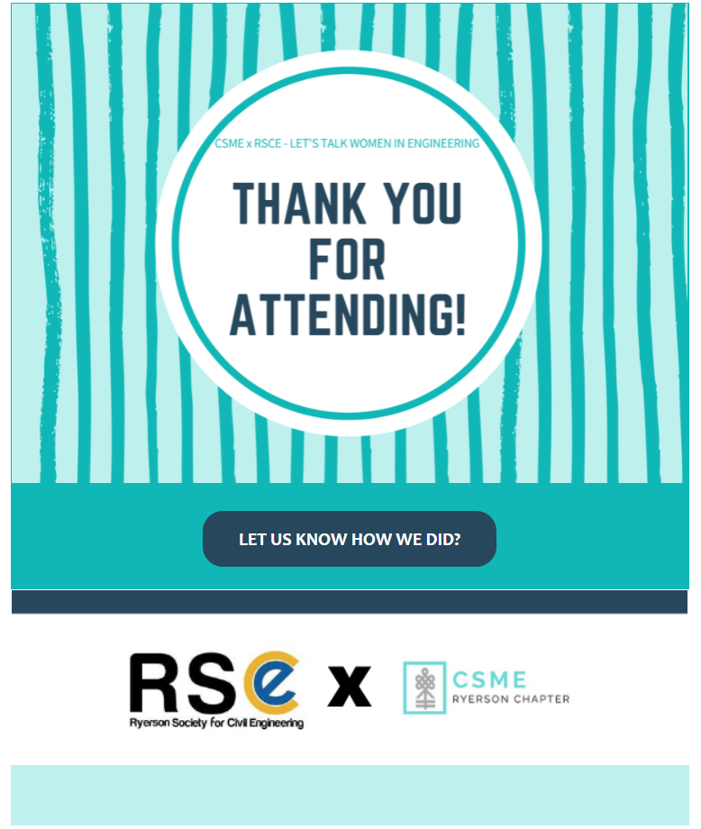

# html-email-newsletter
> HTML email newsletter template structured as a table to linearly section content. The newsletter contains buttons that are directly hyperlinked to event surveys for logistics management purposes. The sample codes were applied to engineering events hosted by the Canadian Society for Mechanical Engineering (CSME) - Ryerson Chapter

## Table of contents
* [General info](#general-info)
* [Technologies](#technologies)
* [Status](#status)
* [Contact](#contact)

## General info
The purpose of this project is to develop HTML newsletters to send out to participants for engineering based events.

## Technologies
* HTML5
* Visual Studio Code IDE

## Newsletter

## Status
Project is: _finished_

## Contact
Created by [@akansha-n888](https://www.linkedin.com/in/akansha-nagar/) - feel free to contact me!
